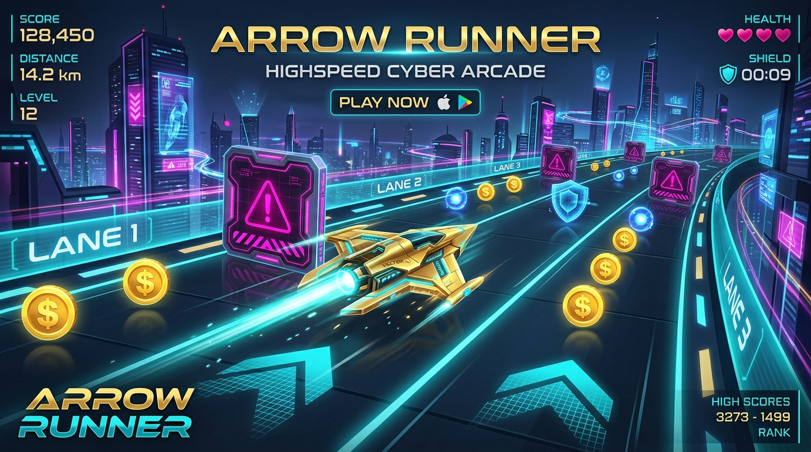

# Arrow Runner

> **A high-speed HTML5 2D canvas endless arcade dodge game packaged for Android via Capacitor 7.**

[](LICENSE)
[](https://developer.android.com)
[](https://developer.mozilla.org)
[](https://capacitorjs.com)
[]()

---

## 📌 Overview

**Arrow Runner** is a lightweight, responsive 60 FPS mobile arcade dodge game. Designed to deliver smooth gameplay on mobile webviews and native Android devices, it combines procedurally scaled speed progression with a 3-lane dodge mechanic, custom Web Audio synthesis, and an in-game vector skin customization shop. 

The project demonstrates how to build zero-dependency HTML5 2D Canvas games and seamlessly package them into production-ready Android APKs using **Capacitor 7**, featuring Android Cloud Auto-Backup persistence and active internet diagnostics.

---

## 🖼️ Media & Demo



<p align="center">
  <i>High-speed cyber arcade gameplay showing multi-lane dodging, power-ups, and skin customization.</i>
</p>

---

## ⚡ Key Features

- **🚀 60 FPS High-DPI Canvas Engine**: Renders sharp vector shapes dynamically scaled to device pixel ratio (`window.devicePixelRatio`).
- **🕹️ Responsive Multi-Lane Controls**: Supports tap-to-move left/right touch controls for mobile screens and keyboard controls (`Arrow Keys` / `A-D`) for desktop browsers.
- **⚡ Dynamic Speed Progression**: Tiered difficulty scaling (+1.25 speed every +2,000 points) culminating in a dramatic **Hyperspeed Jump** at 10,000+ points scaling up to 22.0 speed.
- **🎨 4-Category Vector Skin Shop**: Unlockable skins for Arrows, Hazard Spikes, Orbs, and Coins rendered procedurally without bitmap downloads.
- **🛡️ Power-Up Mechanics**: Includes Shield Crests (obstacle damage absorption) and Super Magnets (multi-lane item attraction).
- **🔊 Web Audio API Sound Synthesizer**: Zero-dependency real-time audio oscillator for collect chimes, hit sounds, and power-up sweeps.
- **📡 Active Network Connectivity Diagnostics**: Real-time connection monitoring with a modal prompt (`#offline-modal`) to pause gameplay when internet access drops.
- **☁️ Android Cloud Auto-Backup**: Preserves high scores, coin balances, skin inventory, and settings across uninstalls via native Android 12+ cloud auto-backup.

---

## 🛠️ Tech Stack

- **Frontend Core**: HTML5 2D Canvas API, ES6+ JavaScript, Web Audio API, CSS3 Rajdhani & Orbitron Typography
- **Native Wrapper**: [Capacitor 7](https://capacitorjs.com/) (Android Bridge Runtime)
- **Build System**: Node.js, npm, Gradle 8.9.1, Android Gradle Plugin (AGP) 8.9.1
- **Android SDK**: `compileSdkVersion 36`, `targetSdkVersion 34`, `minSdkVersion 24`

---

## 📂 Project Structure

```text
Arrow-Runner/
├── docs/                       # Project documentation & visual assets
│   ├── assets/banner.png       # Repository preview banner image
│   ├── ARCHITECTURE.md         # Technical architecture & state machine guide
│   └── GAMEPLAY.md             # Controls, entity reference & skin catalog
├── android/                    # Capacitor 7 Android native project
│   ├── app/                    # Android application module & manifest
│   ├── build.gradle            # Native Gradle build scripts (AGP 9.4.1)
│   └── variables.gradle        # Android SDK & dependency version definitions
├── publishing_assets/          # Play Store & publishing graphics / APK outputs
├── www/                        # Built web assets distribution directory
├── index.html                  # Single-file HTML5 Canvas game engine & UI
├── manifest.json               # Web App Manifest definition
├── capacitor.config.json       # Capacitor app identifier configuration
├── package.json                # Project dependencies and build scripts
├── LICENSE                     # MIT License file
└── README.md                   # Repository documentation
```

---

## 🚀 Getting Started

### Prerequisites

- **Node.js**: v18.0.0 or higher
- **npm**: v9.0.0 or higher
- **JDK**: Java 17 or higher (Required for Android build)
- **Android SDK**: Android API Level 34 or 36 installed via Android Studio

### Installation & Setup

1. **Clone the repository**:
   ```bash
   git clone https://github.com/parvshah240/Arrow-Runner.git
   cd Arrow-Runner
   ```

2. **Install dependencies**:
   ```bash
   npm install
   ```

3. **Build web distribution assets**:
   ```bash
   npm run build
   ```

4. **Sync web assets to Capacitor Android wrapper**:
   ```bash
   npx cap sync android
   ```

### Running the App

#### A. Web Browser Mode (Local Development)
To launch the game locally in any web browser:
```bash
npm start
```
Open `http://localhost:8080` in your web browser.

#### B. Android Studio Native Build
To open and compile the native Android app:
```bash
npx cap open android
```
In Android Studio:
1. Allow Gradle to perform initial sync.
2. Select an emulator or connected Android device.
3. Press **Run ▶** (or `Shift + F10`).

#### C. Command Line APK Compilation
To compile the debug APK directly from the command line:
```bash
cd android
./gradlew assembleDebug
```
The compiled APK will be generated at:
`android/app/build/outputs/apk/debug/app-debug.apk`

---

## 💡 Usage Examples & Gameplay

### Sample Controls & Runtime State

```javascript
// Example: Moving player vessel left / right
player.moveLeft();   // Transitions player to left lane (LANES[0] = 75px)
player.moveRight();  // Transitions player to right lane (LANES[2] = 375px)

// Example: Sound synthesis trigger with combo scaling
playSound('collect', { combo: 4 }); // Synthesizes audio pitch ramp
```

### Game Screenshot Flow

```text
[ MAIN MENU ]  ──( Tap Start )──>  [ ACTIVE GAMEPLAY ]  ──( Hit Hazard )──>  [ GAME OVER ]
      │                                    │                                      │
 (Skins Shop)                       (Power-Up Spawn)                        (Replay / Save)
      ▼                                    ▼                                      ▼
[ Custom Skins ]                    [ Shield / Magnet ]                    [ Auto-Backup Sync ]
```

---

## 🗺️ Roadmap & Future Improvements

- [ ] **Global Firebase / Supabase Leaderboard**: Integrate real-time online multiplayer leaderboard scores.
- [ ] **Achievements System**: Unlockable achievements for survival milestones and coin accumulation.
- [ ] **Additional Power-Ups**: Slow-motion time dilation and double coin multipliers.
- [ ] **Haptic Feedback**: Integrate `@capacitor/haptics` for tactile vibration on collision and coin collection.

---

## 🤝 Contributing

Contributions, issues, and feature requests are welcome! Feel free to check the [issues page](https://github.com/parvshah240/Arrow-Runner/issues).

1. Fork the Project
2. Create your Feature Branch (`git checkout -b feature/AmazingFeature`)
3. Commit your Changes (`git commit -m 'Add some AmazingFeature'`)
4. Push to the Branch (`git push origin feature/AmazingFeature`)
5. Open a Pull Request

---

## 📜 License

Distributed under the **MIT License**. See [`LICENSE`](LICENSE) for more information.

---

## 👤 Author

**Parv Shah**

- **GitHub**: [@parvshah240](https://github.com/parvshah240)
- **Project Repository**: [Arrow-Runner](https://github.com/parvshah240/Arrow-Runner)
