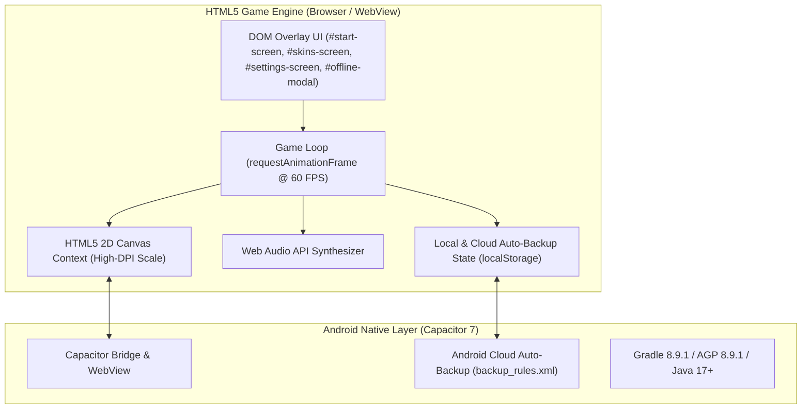

# Arrow Runner — Technical Architecture

This document provides a technical overview of the architecture, rendering engine, state management, audio synthesis, and native mobile container used in **Arrow Runner**.

---

## 🏗️ Architecture Overview

Arrow Runner is built as a zero-dependency HTML5 2D Canvas application wrapped in a native Android shell via **Capacitor 7**.



---

## 🎮 Game Engine Components

### 1. Game Loop & State Machine
The core loop operates via `requestAnimationFrame(gameLoop)` with delta time (`dt`) clamping to prevent physics tunneling during frame drops.

State management is controlled by 4 explicit integer states:
- `STATE_MENU (0)`: Main Menu active, background grid scrolling.
- `STATE_PLAYING (1)`: Main active game state, rendering entities, updating physics & handling input.
- `STATE_PAUSED (2)`: Gameplay frozen, pause overlay displayed.
- `STATE_GAMEOVER (3)`: Collision crash, high score calculation & game over screen.

### 2. High-DPI Canvas Rendering Engine
To ensure ultra-sharp vector graphics on high-density mobile screens (Retina / AMOLED), `setupHighDPICanvas()` dynamically queries `window.devicePixelRatio`:
```javascript
const dpr = Math.min(window.devicePixelRatio || 1, 2.5);
canvas.width = CANVAS_WIDTH * dpr;
canvas.height = CANVAS_HEIGHT * dpr;
ctx.scale(dpr, dpr);
```
All entity vector shapes, trail particles, and glowing power-ups are rendered procedurally using 2D Canvas Path primitives rather than heavy raster bitmaps.

### 3. Procedural Audio Synthesizer (Web Audio API)
Sound effects are dynamically synthesized in real-time using `AudioContext` oscillators and gain nodes—requiring zero external `.wav` or `.mp3` assets:
- **Collect SFX**: Pitch-shifted sine wave with exponential frequency ramp scaling up with combo multipliers.
- **Coin SFX**: High-frequency dual-tone chime.
- **Hit SFX**: Low-frequency sawtooth wave with rapid noise decay.
- **Mega SFX**: Multi-oscillator sweep for shields and magnets.

---

## 📱 Mobile Native Layer (Capacitor 7)

- **WebView Runtime**: Renders `index.html` at 60 FPS with full hardware acceleration.
- **Cloud Auto-Backup**: `backup_rules.xml` and `data_extraction_rules.xml` configure Android 12+ cloud auto-backup to preserve player high scores, total coin balances, unlocked skins, and settings across uninstalls and device transfers.
- **Active Internet Diagnostics**: An active `fetch('https://www.gstatic.com/generate_204?t=' + Date.now())` monitor polls connection status every 2 seconds. If network connection drops, gameplay automatically pauses and presents the `#offline-modal` prompt.

---

## 🛠️ Build Pipeline

1. `npm run build`: Copies web assets (`index.html`, `manifest.json`, assets) into `www/`.
2. `npx cap sync android`: Copies `www/` into `android/app/src/main/assets/public/` and updates Capacitor native dependencies.
3. `gradlew assembleDebug`: Compiles the Android APK via AGP 8.9.1 and SDK 36 (`targetSdkVersion 34`).
